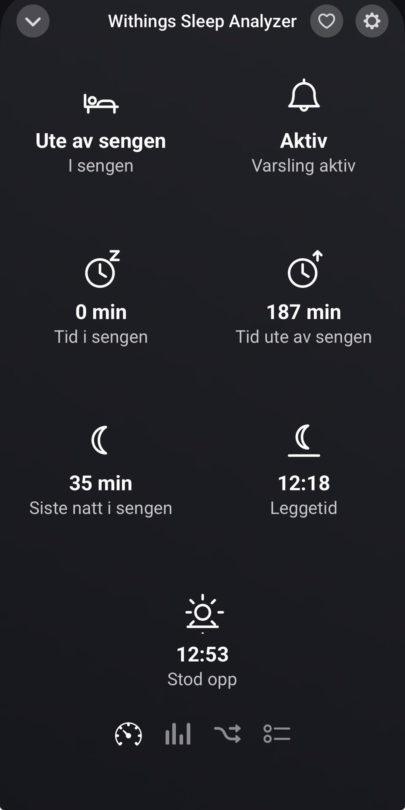
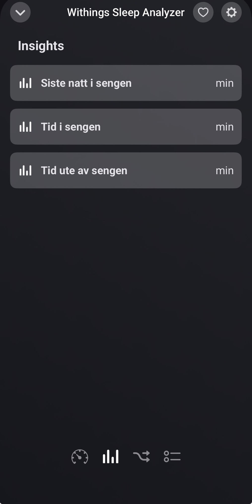
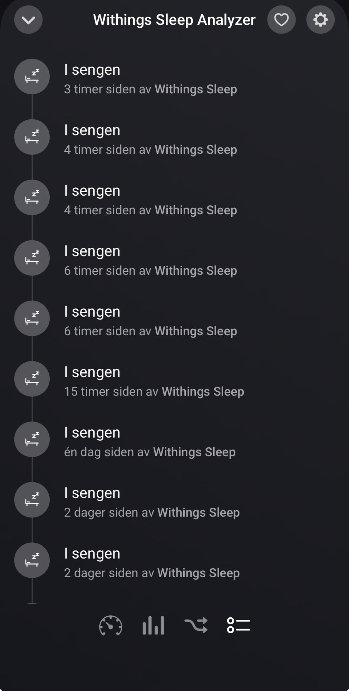

# Withings Sleep for Homey Pro

Bed presence from the Withings Sleep Analyzer, built to survive the failure that
kills the official integration.

## Why this exists

Withings' notification API uses a **separate subscription per data category**
(`appli`). The official Homey app subscribes once at pair time and never checks
again. When the bed-in (`50`) and bed-out (`51`) subscriptions lapse, weight
(`appli 1`) keeps flowing, the OAuth token stays valid, and the device looks
perfectly healthy in Homey's developer tools — but the bed triggers never fire
again, with nothing anywhere reporting an error.

This app verifies both bed subscriptions on a timer and recreates any that have
vanished, exposing the subscription state as a capability so the failure is
visible instead of silent.

## Screenshots

<p>
  <a href="docs/screenshots/device.jpg"></a>
  <a href="docs/screenshots/insights.jpg"></a>
  <a href="docs/screenshots/timeline.jpg"></a>
</p>

## Setup

Three things must exist before the app can pair. Two of them require accounts
only you can create.

### 1. Register a Withings application

At the [Withings Partner Hub](https://developer.withings.com/), create a
**Public Health Data API** application.

Set the callback URL to exactly:

```
https://callback.athom.com/oauth2/callback
```

Copy the client ID and secret into `env.json`.

The app requests the `user.info`, `user.metrics` and `user.sleepevents` scopes.
**`user.sleepevents` is the one that carries bed-in/bed-out** — without it the
subscriptions succeed but no events are ever delivered.

### 2. Register a Homey webhook

At [tools.developer.homey.app/webhooks](https://tools.developer.homey.app/webhooks),
create a new webhook and copy its ID and secret into `env.json`.

This is what gives Withings a public HTTPS endpoint to POST to. Withings
requires a real domain on port 443 that answers `HEAD` with a 2xx — Athom's
webhook service satisfies this.

Without it the app still works, but falls back to polling and loses realtime
triggering.

### 3. Fill in `env.json`

```json
{
  "WITHINGS_CLIENT_ID": "...",
  "WITHINGS_CLIENT_SECRET": "...",
  "WEBHOOK_ID": "...",
  "WEBHOOK_SECRET": "..."
}
```

`env.json` is gitignored. `env.json.example` is the template.

## How it works

```
Sleep Analyzer → Withings cloud → webhook (appli 50/51)
                                     ↓
              https://webhooks.athom.com/webhook/<WEBHOOK_ID>?homey=<homeyId>
                                     ↓
                          Homey → flow triggers
```

A poll of the sleep series runs alongside as a safety net, and a subscription
check runs every few hours (configurable per device).

### OAuth notes

Withings' token endpoint is not plain OAuth2: every call to `/v2/oauth2` needs
an `action=requesttoken` parameter plus a `nonce` fetched from `/v2/signature`,
and both requests carry an HMAC-SHA256 signature over their parameters sorted by
name and joined with commas. `lib/withings-api.js` handles this; it is the part
most third-party clients get wrong.

Access tokens last 3 hours, refresh tokens 1 year.

## Flow cards

| Type | Card |
| --- | --- |
| Trigger | Someone gets into bed |
| Trigger | Someone gets out of bed |
| Trigger | The Withings notification subscription is lost |
| Condition | Someone is / isn't in bed |
| Action | Renew the Withings notification subscription |

The third trigger is the point: if the subscription ever lapses again, you get
told rather than discovering it weeks later.

## Development

```bash
npm test                    # node --test, no network
npm run validate            # homey app validate
homey app run --remote      # upload to the Homey Pro and run there
```

Use `--remote`. Without it, CLI v4 builds the app into a local Docker container
and requires Docker Desktop to be running; `--remote` uploads straight to the
Homey Pro instead and needs no Docker.

## Publishing

The app is at 1.0.0 and passes `homey app validate --level publish`.

```bash
npm test
npm run validate            # publish level
homey app publish
```

`homey app publish` uploads a build to the Homey App Store and opens it for
Athom's review. The version in `app.json` must be bumped for every submission,
and every version needs a matching entry in `.homeychangelog.json`.

Two things are still open before submitting:

- **Artwork.** The app images in `assets/images/` are a Withings product
  photograph, used with no licence from Withings. The driver images in
  `drivers/sleep_analyzer/assets/` are still flat brand-colour placeholders.
  Athom reviews artwork.
- **Brand name.** The app is called "Withings Sleep" and uses Withings' brand
  colour. Athom's guidelines restrict using a manufacturer's name and marks
  without permission; the store listing may need renaming.
